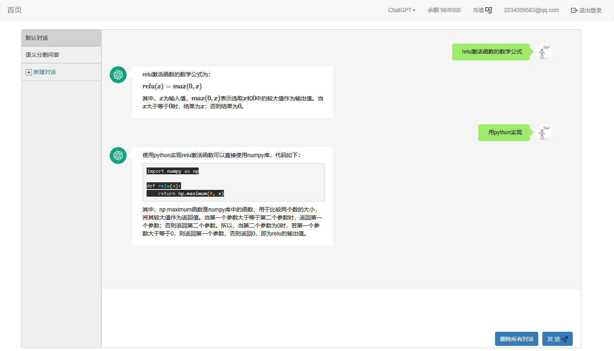

### ChatGPT对话问答
#### 1. 实际效果
体验网址：zhongzhaoxie.top       



#### 2. 参考资料
1. [B站视频教程](https://www.bilibili.com/video/BV1SL411m7ig/?vd_source=12e69465beb2a85d55cc72ffbbda1f23#reply161834820144)         
2. https://v4.bootcss.com/docs/getting-started/introduction/            
3. https://docs.jinkan.org/docs/jinja2/templates.html          

#### 3. todolist
上线网站需要功能：
* 流式回答问题（已完成）
* 公式显示（已完成）
* 账号余额显示（已完成）
* 新建对话, 删除对话，自动恢复用户之前聊天记录（已完成）
* 能够联系上下文回答问题 （已完成）
* 加入账号注册和验证码 (已完成)     
* 通过邮件找回密码（已完成）
* 代码暗黑显示以及复制功能（正在进行中）
* 加入支付宝和微信充值功能（正在进行中）
* 加入免责申明
* 适应手机界面

#### 4. 项目部署    
uwsgi处理动态请求，nginx负责静态页面      
    
uwsgi启动命令方式(创建虚拟环境安装`pip install uwsgi`)：         
```angular2html
uwsgi --http :12345 --wsgi-file app.py --callable app
```
uwsgi配置文件启动方式：   
* 创建uwsgi.ni
```angular2html
[uwsgi]
socket = 127.0.0.1:12345
chdir = /home/ubuntu/project/chatgpt
wsgi-file = app.py
callable = app
processes = 1
threads = 2
buffer-size = 65536
```
* 执行命令        
```angular2html
uwsgi --ini uwsgi.ini
```
* 停止   
```angular2html
ps -ef | grep uwsgi
kill -9 PID
```
Nginx主要配置:     
```angular2html
- 普通请求  --> 12345端口
- /static/ --> /yourpath/chatgpt/static
```
Nginx常用得命令：     
```angular2html
### nginx安装   
sudo apt install nginx      

### nginx运行、停止、重启、查看状态
sudo /etc/init.d/nginx start
sudo /etc/init.d/nginx stop
sudo /etc/init.d/nginx restart
sudo /etc/init.d/nginx status
```
然后修改`nginx`的配置文件`vim /etc/nginx/sites-available/default`, 最后重启`nginx`即可.     
```angular2html
server{
        listen 80;

        server_name 54.251.176.5; #公网IP地址

        root /home/ubuntu/project/chatgpt/static; #改为自己项目的静态文件

        location / {
                include uwsgi_params; #uwsgi默认的配置参数名
                uwsgi_pass 127.0.0.1:12345; # 指向uwsgi内部地址
                
                # 指向虚拟环境
                uwsgi_param UWSGI_PYHOME /home/ubuntu/miniconda3/envs/chatgpt;
                # 指向项目根目录
                uwsgi_param UWSGI_CHDIR /home/ubuntu/project/chatgpt;
                # 指定启动程序
                uwsgi_param UWSGI_SCRIPT manage:app;
        }

}
```
#### 5. 简单的压力测试（webbench）
```angular2html
webbench -c 1000 -t 10 http://zhongzhaoxie.top/
* -c 表示并发数        
* -t 表示运行测试URL的时间（秒）     
Webbench - Simple Web Benchmark 1.5
Copyright (c) Radim Kolar 1997-2004, GPL Open Source Software.

Benchmarking: GET http://zhongzhaoxie.top/
1000 clients, running 10 sec.

Speed=10392 pages/min, 32043 bytes/sec.
Requests: 1732 susceed, 0 failed.
```
#### 6. 参考
[flask实现验证码](https://www.cnblogs.com/huxiansheng/p/11987259.html)


