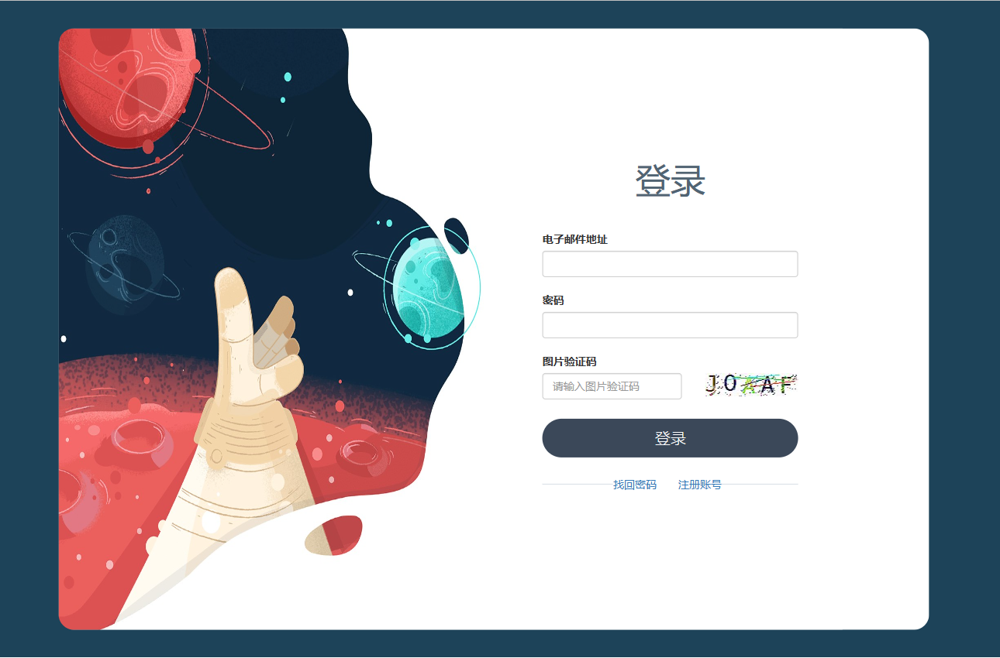

### ChatGPT对话问答
#### 1. 实际效果
体验网址：[zhongzhaoxie.top](zhongzhaoxie.top)     
账户：huhui            
密码：123               

#### 2. 参考资料
1. [B站视频教程](https://www.bilibili.com/video/BV1SL411m7ig/?vd_source=12e69465beb2a85d55cc72ffbbda1f23#reply161834820144)         
2. https://v4.bootcss.com/docs/getting-started/introduction/            
3. https://docs.jinkan.org/docs/jinja2/templates.html          

#### 3. todolist
上线网站需要功能：
* 流式回答问题（已完成）
* 公式显示（已完成）
* 账号余额显示（已完成）
* 新建对话, 删除对话，自动恢复用户之前聊天记录（已完成）
* 能够联系上下文回答问题 （已完成）
* 加入账号注册和验证码 (已完成)     
* 通过邮件找回密码（已完成）
* 代码暗黑显示以及复制功能（正在进行中）
* 加入支付宝和微信充值功能（正在进行中）
* 加入免责申明
* 适应手机界面

#### 4. 参考
[flask实现验证码](https://www.cnblogs.com/huxiansheng/p/11987259.html)

